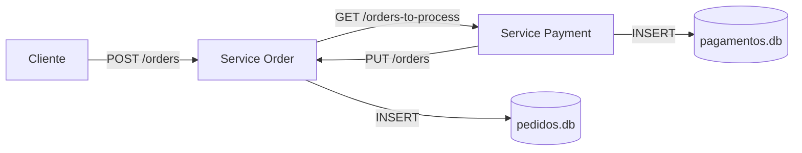

# Desafio Arquitetura de Aplicações

# 🛒 Microserviço de Pedidos e Pagamentos

Este projeto é uma aplicação de estudo de **arquitetura de microserviços**, utilizando **Node.js**, **Express** e **SQLite**.

Ele é composto por **dois serviços independentes**:

- **Service Order** → Responsável pela criação e gerenciamento de pedidos.
- **Service Payment** → Responsável por processar pedidos e registrar pagamentos.

Cada serviço possui **seu próprio banco de dados** (`SQLite`), reforçando o princípio de que cada microserviço é dono dos seus dados.

---

## ⚙️ Arquitetura

Fluxo da aplicação:

1. O cliente cria um **pedido** no `Service Order`.
2. O `Service Payment` busca pedidos **pendentes** no `Service Order`.
3. O pedido é **registrado como pagamento processado** no `Service Payment`.
4. O `Service Payment` envia uma atualização ao `Service Order`, marcando o pedido como **processado**.



---

## 📂 Estrutura do Projeto

```
.
├── service-order
│   ├── index.js         # Código principal do serviço de pedidos
│   └── pedidos.db       # Banco SQLite do serviço de pedidos
│
├── service-payment
│   ├── index.js         # Código principal do serviço de pagamentos
│   └── pagamentos.db    # Banco SQLite do serviço de pagamentos
│
└── README.md            # Documentação do projeto

```

---

## 🚀 Tecnologias Utilizadas

- Node.js
- Express
- SQLite
- Axios (para comunicação entre microserviços)

---

## ▶️ Como Executar

### 1. Clonar o repositório

```bash
git clone https://github.com/seu-usuario/microservices-orders-payments.git
cd microservices-fiap

```

### 2. Instalar dependências

Cada serviço tem suas dependências próprias. Instale em cada pasta:

```bash
cd service-order
npm install

cd ../service-payment
npm install

```

### 3. Rodar os serviços

Abra dois terminais:

```bash
# Terminal 1 - Service Order
cd service-order
node index.js

```

```bash
# Terminal 2 - Service Payment
cd service-payment
node index.js

```

- **Service Order**: roda em `http://localhost:3001`
- **Service Payment**: roda em `http://localhost:3030`

---

## 📌 Endpoints Disponíveis

### 🔹 Service Order (`http://localhost:3001`)

- `GET /orders` → Lista todos os pedidos.
- `GET /orders-to-process` → Lista apenas pedidos **pendentes**.
- `POST /orders` → Cria um novo pedido.
    
    ```json
    {
      "nomeProduto": "Guidão de Moto",
      "formaDePagamento": "Crédito",
      "valorProduto": 99.99,
      "quantidade": 2
    }
    
    ```
    
- `PUT /orders` → Atualiza um pedido para **processado**.
    
    ```json
    {
      "id": 1
    }
    
    ```
    

---

### 🔹 Service Payment (`http://localhost:3030`)

- `POST /orders` → Processa os pedidos pendentes do `Service Order` e registra no banco de pagamentos.

Resposta de exemplo:

```json
{
  "message": "Pagamentos confirmados",
  "confirmed": 2
}

```

---

## 🗄️ Estrutura das Tabelas

### 📌 Service Order (`pedidos.db`)

```sql
CREATE TABLE IF NOT EXISTS pedidos (
    id INTEGER PRIMARY KEY AUTOINCREMENT,
    nomeProduto TEXT NOT NULL,
    formaDePagamento TEXT NOT NULL,
    valorProduto DECIMAL NOT NULL,
    quantidade INTEGER NOT NULL,
    valorTotal DECIMAL NOT NULL,
    processado BOOLEAN DEFAULT 0
);

```

### 📌 Service Payment (`pagamentos.db`)

```sql
CREATE TABLE IF NOT EXISTS pagamentosProcessados (
    id INTEGER PRIMARY KEY AUTOINCREMENT,
    nomeProduto TEXT NOT NULL,
    formaDePagamento TEXT NOT NULL,
    valorProduto DECIMAL NOT NULL,
    quantidade INTEGER NOT NULL,
    valorTotal DECIMAL NOT NULL,
    processado BOOLEAN DEFAULT 1
);

```

---

## 🔮 Possíveis Melhorias Futuras

- [ ]  Migrar comunicação para **event-driven** (Kafka, RabbitMQ ou Redis).
- [ ]  Substituir SQLite por banco mais robusto (PostgreSQL/MySQL).
- [ ]  Adicionar autenticação/segurança (JWT ou API Key).
- [ ]  Criar observabilidade (logs estruturados e métricas).

---

## 👨‍💻 Autor

Projeto desenvolvido por **Thiago Lemos** 🎯

💼 Focado em estudos de **microserviços e arquitetura distribuída** com Node.js.
